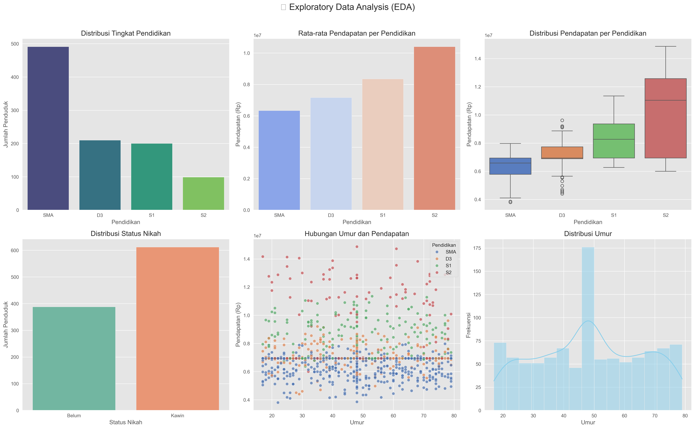

# 📊 Aplikasi Analisis Penduduk - Proyek Remastered 2025

[](https://opensource.org/licenses/MIT)
[](https://www.python.org/)
[](https://streamlit.io/)
[](https://pandas.pydata.org/)
[](https://scikit-learn.org/)

[](https://github.com/LycusCoder)
[](https://linkedin.com/in/nourivex)
[](mailto:affif@nourivex.tech)

> 🎯 Aplikasi prediksi status pernikahan dan pendapatan berdasarkan umur dan tingkat pendidikan — dengan augmentasi data, imputasi nilai kosong, EDA interaktif, dan antarmuka web menggunakan Streamlit.

---

## 🚀 Overview

Aplikasi ini dibuat sebagai proyek akhir analisis data penduduk dengan fitur utama:

| Fitur | Deskripsi |
|-------|-----------|
| 🧪 Augmentasi Data | Tambah data sintetis hingga 200 baris |
| 🧹 Imputasi Nilai Kosong | Gunakan median & model prediksi untuk isi NaN |
| 📈 EDA Visualisasi | Distribusi pendidikan, rata-rata pendapatan, boxplot, dll. |
| 🤖 Prediksi ML | Status Nikah (Klasifikasi), Pendapatan (Regresi) |
| 🌐 Web App | Antarmuka interaktif menggunakan Streamlit |

---

## 📦 Struktur Folder

```
penduduk_analisis_app/
├── app.py                      # Aplikasi Streamlit
├── clean_data.py               # Imputasi nilai kosong
├── eda.py                      # Visualisasi data
├── generate_data.py            # Augmentasi dataset
├── train_model.py              # Pelatihan model ML
├── requirements.txt            # Daftar library
│
├── data/                       # Folder dataset
│   ├── dataset_penduduk.csv    # Dataset asli (20 baris)
│   ├── generated_data.csv      # Dataset hasil augmentasi (200+ baris)
│   └── cleaned_data.csv        # Dataset setelah imputasi
│
├── model/                      # Model hasil pelatihan
│   ├── label_encoders.pkl
│   ├── model_status_nikah.pkl
│   └── model_pendapatan.pkl
│
└── output/                     # Output visualisasi
    └── eda_visualization.png
```

---

## 💻 Teknologi Digunakan

- **Python** – Pandas, Scikit-learn, Matplotlib, Seaborn, Streamlit
- **Machine Learning** – Random Forest Classifier & Regressor
- **Visualisasi** – Matplotlib & Seaborn
- **Web Framework** – Streamlit

---

## 🛠️ Cara Instalasi & Penggunaan

### 1. Clone Repositori

```bash
git clone https://github.com/LycusCoder/Aplikasi-Analisis-Penduduk.git
cd Aplikasi-Analisis-Penduduk
```

### 2. Install Dependencies

```bash
pip install -r requirements.txt
```

### 3. Jalankan Bagian Terpisah (Opsional)

Jika kamu ingin membangun/menjalankan satu per satu:
```bash
python generate_data.py     # Augmentasi dataset ke 200 baris
python clean_data.py         # Imputasi nilai kosong
python eda.py                # Visualisasi data
python train_model.py        # Latih model ML
streamlit run app.py         # Jalankan aplikasi web
```

### 4. Jalankan Aplikasi Web

```bash
streamlit run app.py
```

---

## 🧪 Fitur Utama Aplikasi

- 📊 Statistik deskriptif dan visualisasi data
- 🔮 Prediksi individual berdasarkan input form
- 📦 Prediksi massal via upload CSV
- 📤 Unduh hasil prediksi sebagai file CSV

---

## 🖼 Demo Tampilan Aplikasi



---

## 📜 License

MIT License – lihat file [LICENSE](LICENSE) untuk detail.

```
Copyright (c) 2025 Affif (Nourivex)

Permission is hereby granted, free of charge, to any person obtaining a copy
of this software and associated documentation files (the "Software"), to deal
in the Software without restriction, including without limitation the rights
to use, copy, modify, merge, publish, distribute, sublicense, and/or sell copies
of the Software, and to permit persons to whom the Software is furnished to do so,
subject to the following conditions:
...
```

---

## 👤 Kontak & Profil Penulis

Ingin berdiskusi, berkolaborasi, atau menyebut proyek ini? Jangan ragu menghubungi saya melalui platform berikut:

| Platform | Link |
|---------|------|
| GitHub  | [LycusCoder](https://github.com/LycusCoder) |
| LinkedIn | [Nourivex](https://linkedin.com/in/nourivex) |
| Email   | affif@nourivex.tech |

---

