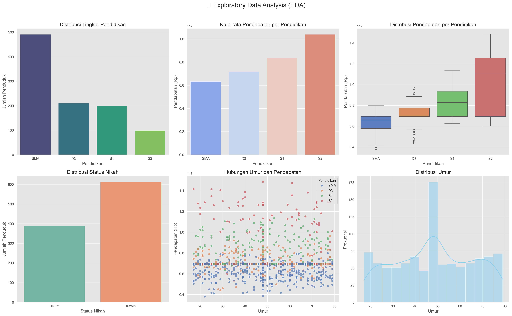
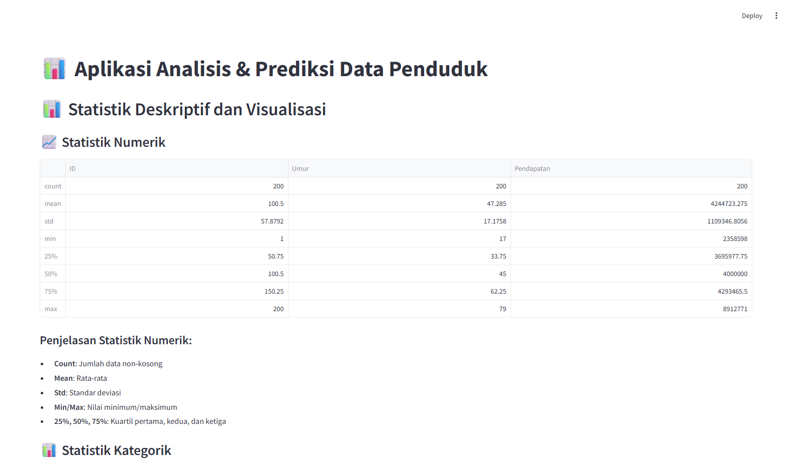

<!-- Cover Slide -->
# 📊 Aplikasi Analisis Penduduk  
### Remastered 2025  
**Augmentasi • Imputasi • EDA • Prediksi • Streamlit**  



---

<!-- Slide 1: Badge & Info Proyek -->
## 📌 Proyek & Badge

[](https://opensource.org/licenses/MIT)  
[](https://www.python.org/)  
[](https://streamlit.io/)  
[](https://scikit-learn.org/)

---

<!-- Slide 2: Overview -->
## 🚀 Overview  
Aplikasi ini melakukan:  
1. **Augmentasi** data penduduk dari 20→200 baris  
2. **Imputasi** nilai kosong (Umur, Pendapatan, Status)  
3. **EDA** interaktif & visualisasi  
4. **Prediksi ML**: Status Nikah & Pendapatan  
5. **Web App** dengan Streamlit  

---

<!-- Slide 3: Struktur Folder -->
## 📦 Struktur Folder  
```

penduduk\_analisis\_app/
├── data/
│   ├── dataset\_penduduk.csv
│   ├── generated\_data.csv
│   └── cleaned\_data.csv
├── model/
│   ├── model\_status\_nikah.pkl
│   ├── model\_pendapatan.pkl
│   └── label\_encoders.pkl
├── output/
│   └── eda\_visualization.png
├── app.py
├── generate\_data.py
├── clean\_data.py
├── eda.py
├── train\_model.py
└── requirements.txt

````

---

<!-- Slide 4: Dataset Awal -->
## 📄 Dataset Awal (20 Baris)
| ID | Umur | Pendidikan | Pendapatan | Status Nikah |
|----|------|------------|------------|--------------|
| 1  | 25   | SMA        | 4.000.000  | Belum        |
| 2  | 28   | D3         | 4.500.000  | Kawin        |
| 3  | 35   | S1         | —          | Kawin        |
| …  | …    | …          | …          | …            |
| 20 | 23   | SMA        | —          | Belum        |

---

<!-- Slide 5: Augmentasi -->
## 🧬 Augmentasi Data  
- Tambah **180 baris sintetis** → total ≥200  
- **Umur**: 17–80 tahun  
- **Pendidikan**: SMA, D3, S1, S2  
- **Pendapatan** mengikuti distribusi per jenjang  
- Simpan → `data/generated_data.csv`

```python
# generate_data.py (snippet)
from faker import Faker
# ...
````

---

<!-- Slide 6: Imputasi -->

## 🧹 Imputasi Nilai Kosong

* **Median** untuk Umur & Pendapatan
* **Random Forest Classifier** untuk Status Nikah
* Hasil → `data/cleaned_data.csv`

```python
# clean_data.py (snippet)
from sklearn.impute import SimpleImputer
# ...
```

---

<!-- Slide 7: EDA -->

## 📊 EDA & Visualisasi

* Distribusi Pendidikan
* Rata-rata Pendapatan per Pendidikan
* Boxplot Pendapatan
* Scatterplot Umur vs Pendapatan
* Histogram Umur, Pie Status Nikah
* Export → `output/eda_visualization.png`

---

<!-- Slide 8: Pelatihan Model -->

## 🤖 Pelatihan Model

* **RandomForestClassifier** → Status Nikah

  * Akurasi: \~90%
* **RandomForestRegressor** → Pendapatan

  * R² Score: \~0.85
* Save:

  * `model/model_status_nikah.pkl`
  * `model/model_pendapatan.pkl`

---

<!-- Slide 9: Prediksi Individual -->

## 👤 Prediksi Individual

1. Input: Umur & Pendidikan
2. Klik “Predict”
3. Tampil:

   * Status Nikah
   * Estimasi Pendapatan

---

<!-- Slide 10: Prediksi Massal -->

## 📦 Prediksi Massal

1. Upload CSV (kolom: Umur, Pendidikan)
2. Model → massal
3. Download `hasil_prediksi_massal.csv`

---

<!-- Slide 11: Demo Tampilan -->

## 🖼️ Tampilan Aplikasi



* Sidebar navigasi
* Grafik interaktif (Plotly)
* Form & tabel hasil

---

<!-- Slide 12: Teknologi -->

## 🛠️ Teknologi

* **Python 3.8+**
* **Pandas**, **NumPy**
* **Scikit-learn**
* **Matplotlib**, **Seaborn**, **Plotly**
* **Streamlit**
* **Joblib** / Pickle

---

<!-- Slide 13: Pengembangan -->

## 🚀 Rekomendasi Fitur Tambahan

* Tambah kolom: jenis kelamin, pekerjaan
* REST API (FastAPI)
* Deployment Streamlit Cloud
* Integrasi DB (PostgreSQL / MongoDB)
* Versi mobile/app

---

<!-- Slide 14: Manfaat -->

## 💡 Manfaat & Aplikasi

* Studi kasus akhir semester
* Sensus & demografi
* Prototipe portofolio
* Penelitian sosial & ekonomi

---

<!-- Slide 15: Kontak -->

## 🙏 Terima Kasih & Kontak

> Ingin lihat kode lengkap atau berdiskusi?

[](https://github.com/LycusCoder)
[](https://linkedin.com/in/nourivex)
[](mailto:affif@nourivex.tech)

---

